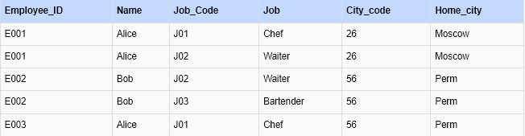

### Практическое задание к семинару 1 "Модели данных и нормализация таблиц. Схема «звезда»"

### Задание 3
Определите, в какой нормальной форме данная таблица, приведите её ко 2 и 3 нормальным формам последовательно.

Ответ. Первая нормальная форма, в каждой ячейке одно значение

    

Приведение выполнено с использованием [скрипта](d1.scala) на scala
Spark и PosrgreSQL были развернуты в docker с использованием [compose](docker-compose.yaml)

